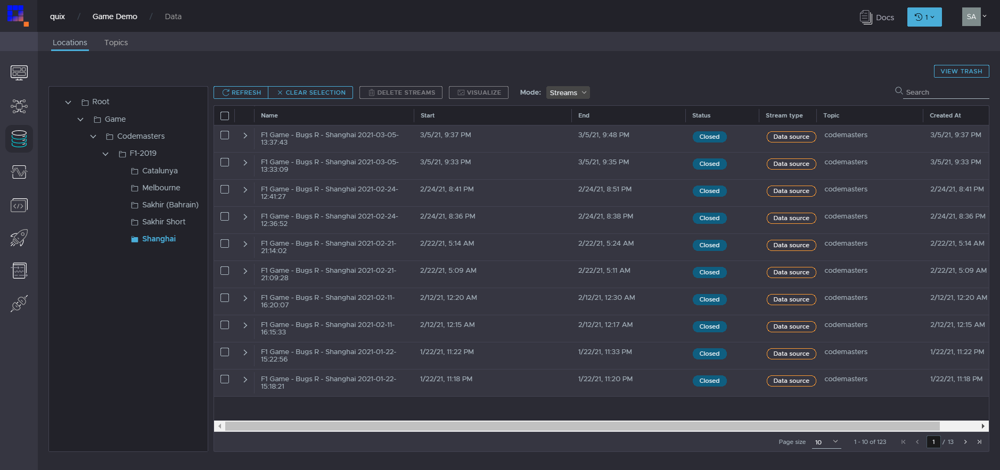

# F1&reg; Bridge

F1&reg; is the official FIA Formula One game series developed by [Codemasters](https://www.codemasters.com). You can take your gaming experience to the next level by live streaming your in-game telemetry data on Quix and performing visualisations, analytics and simulations just like the real Formula One teams do.

This guide shows you how to obtain, stream and visualise your F1&reg; 2019 game from a PC or gaming console with Quix. You can follow the same procedure for later editions of the game as long as the UDP format in the telemetry settings is 2019-compatible.

## Setup

There is no special setup required for your game station except that it has an internet connection because the application uses UDP protocol to receive data from the game and stream it over the internet to Quix.

We will develop a dotnet core cross platform application that runs on a local computer and streams your game data to Quix. The only requirements are that you have [dotnet core runtime](https://dotnet.microsoft.com/download/dotnet/3.0) installed on the machine you are going to run this application on, that that machine is connected to the same network your game station is connected to and that the machine has an internet connection to connect to Quix.

If you do not yet have a Quix account, you can sign up for one from our [website](https://quix.ai). We assume that you have F1&reg; 2019 game installed on your preferred gaming platform.

## Create a workspace

If you do not already have a Quix workspace, logon to Quix and create a workspace using the _Create New Workspace_ button. Enter a workspace name in the proceeding dialog and click on _Create_.


## Create a topic

Before we can write game data to a Quix stream, we need to create a topic to hold that stream. Navigate to your Quix workspace, select _Topics_ from the navigation panel and click on _Create Topic_ to create a topic. It may take a few seconds to get things set up for you. We are going to save our game data to persistent storage so we can use it later for visualisation purposes. So, throw the _Persistence_ switch to _ON_ for our topic after it has been created.


For more information on topics, please visit our [platform documentation](https://quix.ai/docs/product/UsingQuix.html#_topics).

# Create a project

We have already installed the project in our project library. Navigate to _Library_ on Quix using the left navigation panel, select _Sample Projects_.

Set the output topic to the topic you created in the preceding section, choose your preferred programming language (we will go with C# here) and select the "Bridge.Codemasters" template for _Sample project_.

At this point, you can download the project as a zip file using _Download Zip_ button and run it. However, if you would like to customise your application, it's better to create a project based on our template using the _Save As Project_ button. This will allow you to take advantage of integrated git version control system of Quix to keep track of your changes.


When you click on the _Save As Project_, create project dialog will open and you will be navigated to your newly created project in our online code editor after you click on _Create_.

## Build and run the application

We will continue to use Quix online code editor. However, if you downloaded the zip file in the previous section without creating project, you can open the C# project on your preferred code editor and navigate to the `appsettings.json` file.


Our application can stream telemetry either from a live game or a previously recorded game. Hence, the application configuration supports two input types: `file` and `udp`. If we were going to stream a game from a set of files, we would configure the path to these files in `FileInput.FilePaths`. However, since we are going to stream telemetry from a live game, we have set the `Input` to `udp`. UDP configuration is under the `UDPInput` section. If you want to save telemetry data to files, you can set the `RecordToFile.Enabled` to `true`. This will save your game telemetry to the folder specified in `UDPInput.RecordToFile.Folder` while streaming the live data to Quix. You can then replay these files later using the same service by setting the `Input` to `file`. We are going to stream data for the player. If you like to stream telemetry for all drivers in the race, set the `StreamSettings.IncludeOtherDrivers` to `true`.

Take note of the UDP port as this must match the UDP port setting in the game. Now you are ready to compile and run the dotnet application.

From the _source_ directory, run the following command to build a platform independent executable from the _Bridge.Codemasters.Console_ project.

```
dotnet publish .\Bridge.Codemasters.Console\Bridge.Codemasters.Console.csproj -c Release  --output .\bin\
```

For more information on dotnet publishing tools and options please refer to [official documentation](https://docs.microsoft.com/en-us/dotnet/core/tools/dotnet-publish). Run the published app using the following command from the _bin_ folder:

```
dotnet Bridge.Codemasters.Console.dll
```
If the application starts successfully, you will see the log line `Reader open` on the application console.

## Configure F1&reg; telemetry

While the Quix application is running, fire up the F1 game and navigate to "Game Options" from the main menu.


Select the "Settings" menu from game options.


From the game settings, navigate to "Telemetry Settings".


In the telemetry settings, make sure that "UDP Telemetry" is set to "On" and that the UDP port matches the port we configured our dotnet application with. If you are using a later edition of the game, please set the UDP format to 2019.


Above steps expose telemetry data over UDP which is what our client application is listening to. You are all set to go! Open any game mode and start a race. You will see your game telemetry appear on the application console as you race.


The dotnet application is creating streams for every race in the topic you initially created. If you go back to the Quix workspace, navigate to visualise from the left navigation panel, you can see all the streams and parameters you are streaming.



Select stream(s) and parameter(s) you like, and you can view and analyse your performance using our [Visualize](https://documentation-40c5b57b-a938-4925-93a9-25df5a64e54f.platform.quix.ai/visualise/) feature.


## Next steps

Now that you can stream telemetry data from your races live, you can develop more services using our [SDKs](https://quix.ai/docs/sdk/introduction.html) to read from raw data streams and run your own simulations on them in real-time. You can build and deploy client applications like web and mobile apps that consume these live data streams and create fantastic live visualisations.
